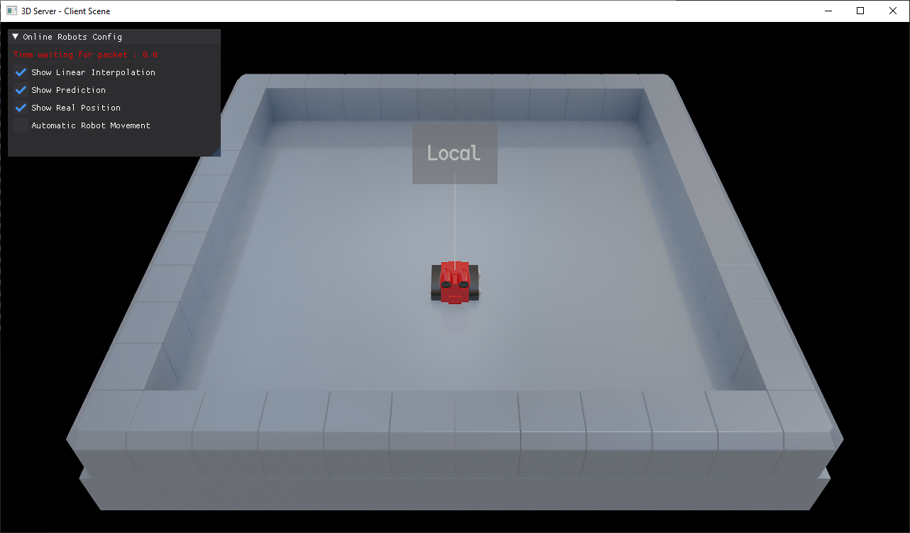
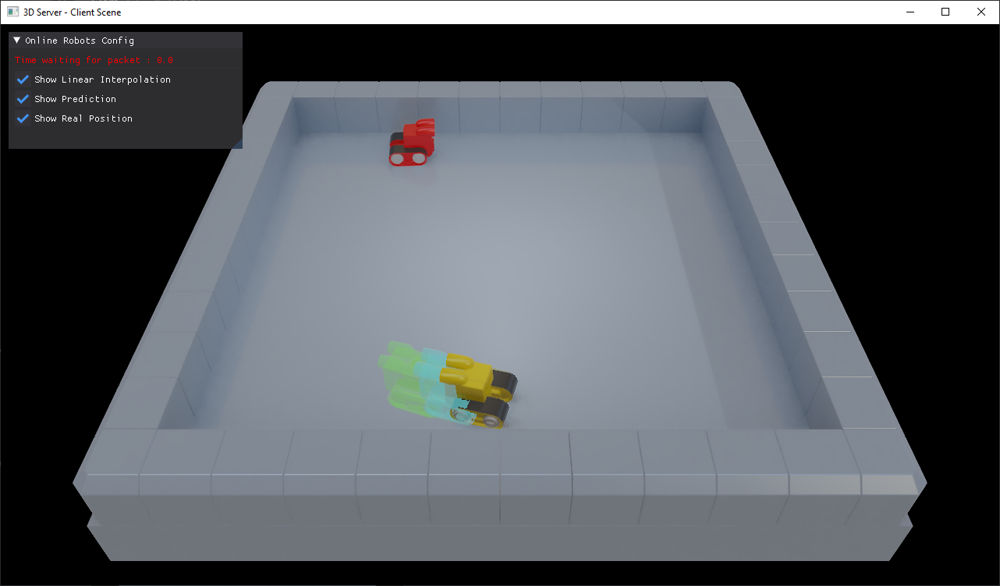
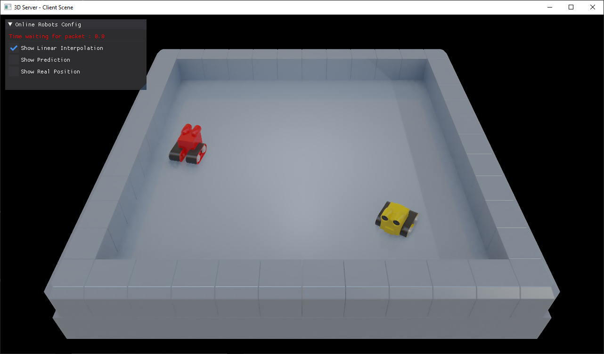
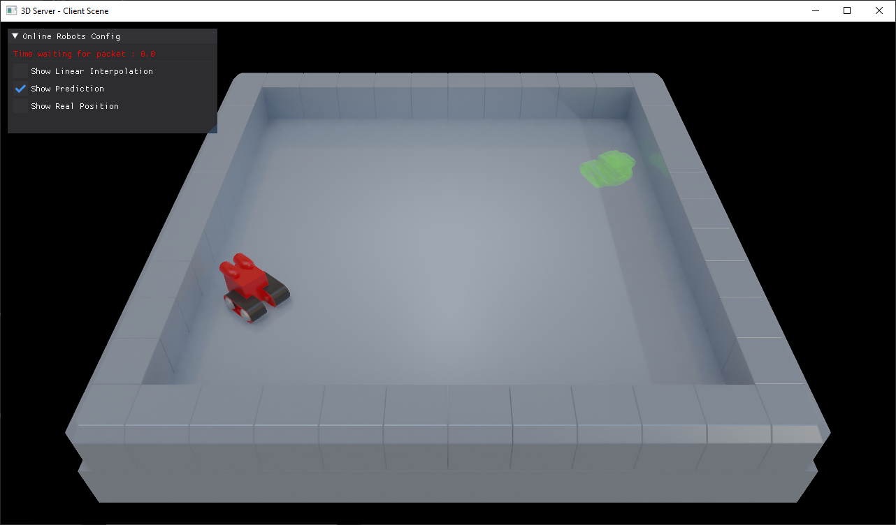
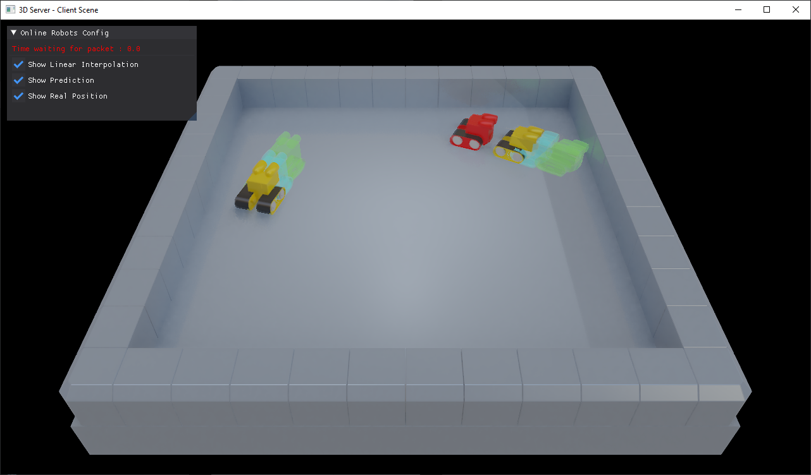

# HARFANG® 3D Server - Client

This **app** demonstrates the usage of UDP Sockets using the HARFANG API in **Python** in order to link a server and one or more clients.

It also includes some basic client prediction and interpolation.

To run the prototype:

1. Download or clone this repository to your computer _(eg. in `C:/server_client_3D`)_.
2. Download _assetc_ for your platform from [here](https://harfang3d.com/releases) to compile the resources.
3. Drag and drop the resources folder on the assetc executable **-OR-** execute assetc passing it the path to the resources folder _(eg. `assetc C:/server_client_3D/server_client_demo`)_.


After the compilation process finishes, you will see a `server_client_demo_compiled` folder next to resources ( `server_client_demo` ) folder.

You can now execute the prototype from the folder you unzipped it to.

```bash
C:/server_client_3D>python main.py
```

## Screenshots
* Player alone


* With a second player, showing his prediction and interpolation


* With a second player, only interpolated position


* With a second player, only predicted position


* With a third player

